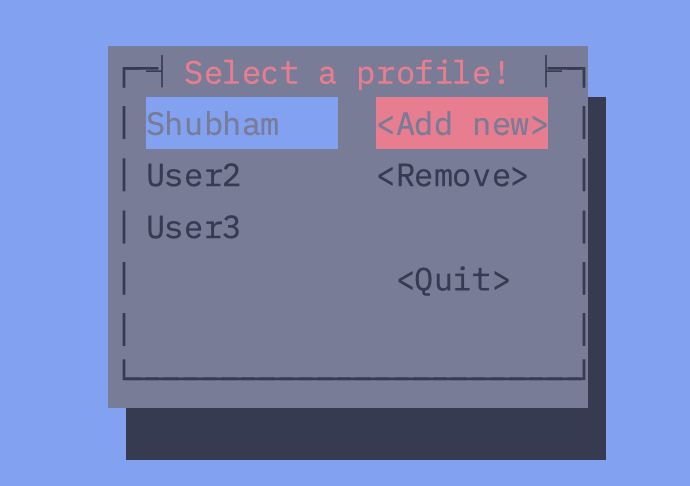

This is a TUI application made using Rust. It creates a simple TUI interface which acts as a contact book. This is one of the projects I've taken on to learn how to create TUI applications in Rust.
The user can add, delete, and view contacts.
Currently it doesn't save the contacts to a file, so the contacts are lost when the application is closed.
We use the `cursive` library to create the TUI interface.



## How to run the application
1. Clone the repository
2. Run the following command in the terminal:
```bash
cargo run
```
3. The application will start and you can interact with it using the keyboard.

## How to use the application
- Use the arrow keys to navigate through the options.
- Press `Enter` to select an option.
- Press `q` to quit the application.
